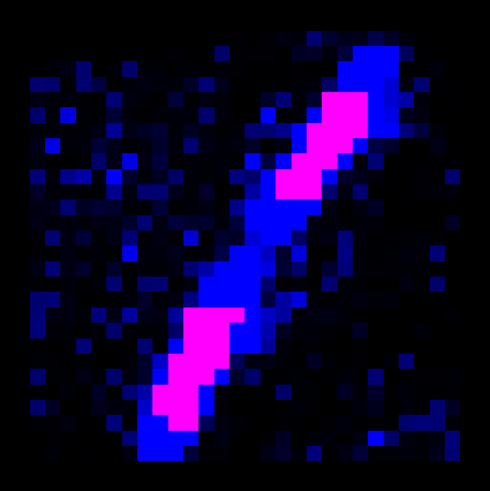

<h1 align="center" style="margin-top: 0px;">Deep Memory: Explicit and Searchable Data Modelling</h1>

    
    
    
    

    
    
    
    

&emsp;

An investigation into the space complexity of structured image data. We sought to understand explicit representations of images - as decomposed into neighborhoods - and the data science requirements to process, store, and recall such representations. The functional code in this project can capture a representation of an image dataset (I used mnist for testing), and query the stored model for likely representations given an existing predicate.

Multiple libraries and code structures were investigated to prototype methods to store and retreive data in high-dimensional space. Sparse matrix representations and large vectors were essential; the [spotify/annoy](https://github.com/spotify/annoy) project proved to best serve our needs from an implementation perspective. 

Conceptually, this project provides some interesting avenues for further investigation into explicitly-structured data, the capture and storage thereof, and subsequent possible applications. 

